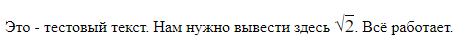

## Katex и Markdown


Этот пример построен на основе репозитория [markdown-it-katex](https://github.com/waylonflinn/markdown-it-katex).

Он представляет собой минимальный код веб-страницы, которая 
порождается средствами `Markdown` и `Katex`.

Главная страница - `index.html`. Просто откройте её с помощью браузера.


`Katex` позволяет выводить математические уравнения, он
является модификацией языка `LaTex`. 

Список доступных команд `KaTex` можно посмотреть [здесь](https://katex.org/docs/supported.html).

Про использование языка `Markdown` написано [здесь](https://ege.buran.center/docs/project/markdown/intro).


## Работа с примером 

Весь код, который нужно будет интерпретировать с помощью `Markdown` и `Katex`,
нужно вводить внутри блока

```html
<div class="toTex">
    ...
</div>
```


Общий принцип написания программ на `Markdown` и `Katex` заключается в 
выделении участков текста специальными символами. При интерпретации
эти участки будут заменены на формулы, заголовки и т.д.

Например, чтобы в текст добавить корень из двух, нужно до 
начала формулы и сразу после неё добавить `$`:


```html
<div class="toTex">
Это - тестовый текст. Нам нужно вывести здесь $\sqrt{2}$. Всё
работает.    
</div>
```

Получим:




Обратите внимание: я не добавил отступов внутри `<div>...</div>`. 
Так делать обязательно. Если мы добавим отступы 

```html
<div class="toTex">
    Это - тестовый текст. Нам нужно вывести здесь $\sqrt{2}$. Всё
    работает.    
</div>
```

То KaTex не сможет обработать команду и просто выведет текст, как он есть в
исходниках:


